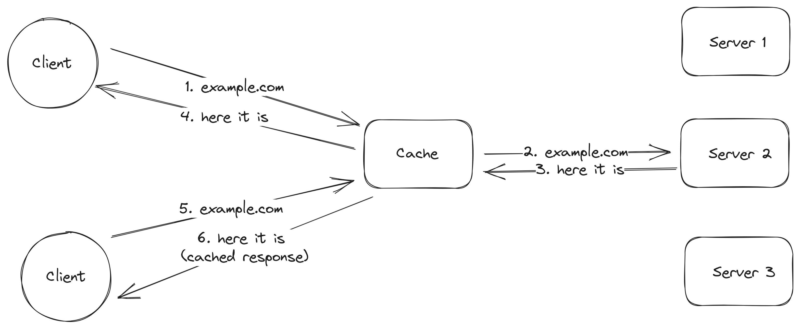
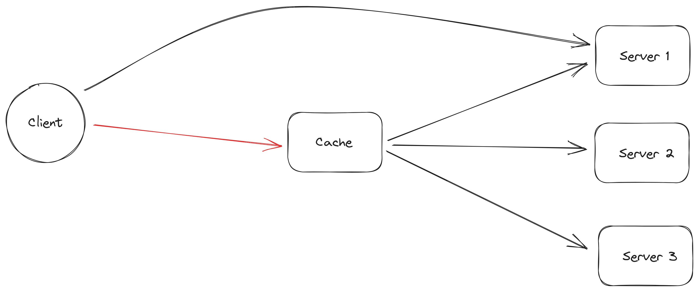
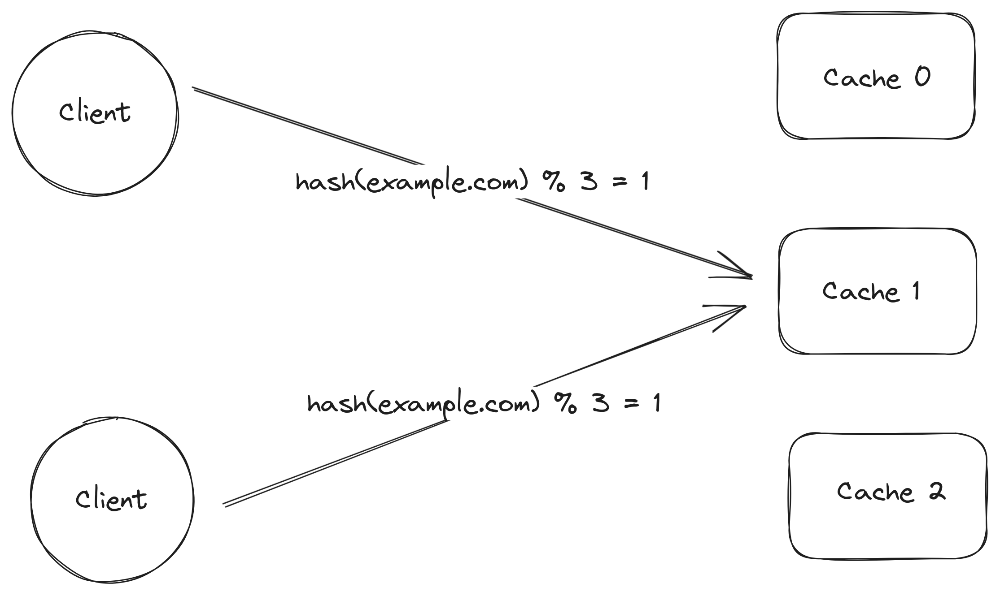
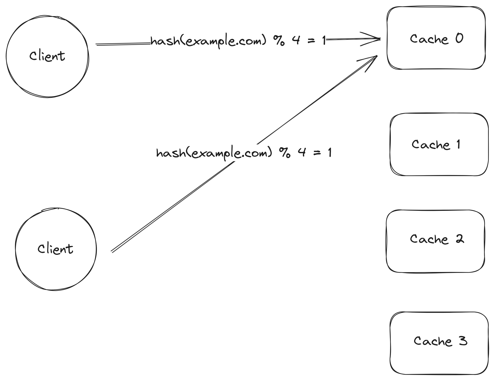
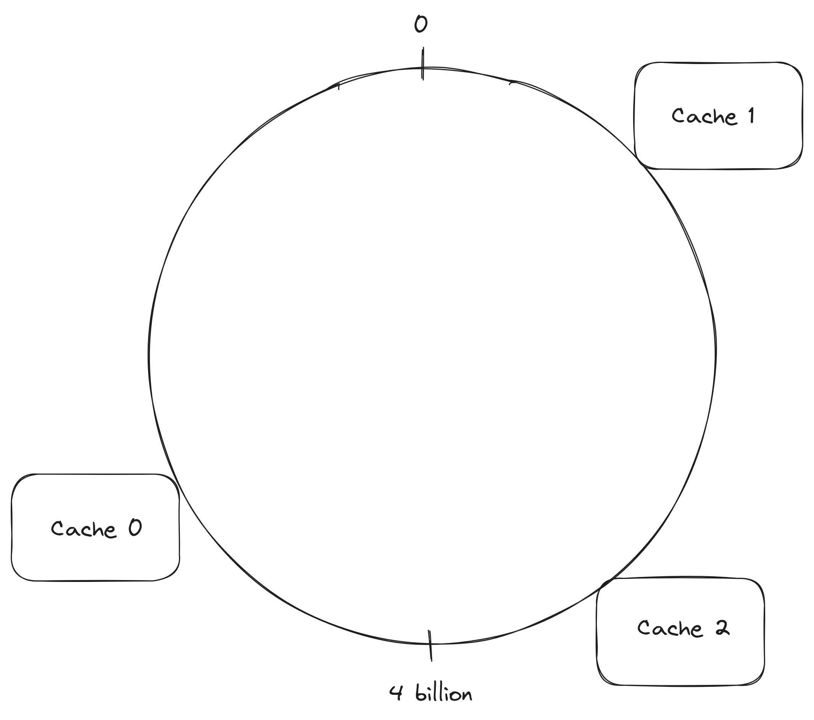
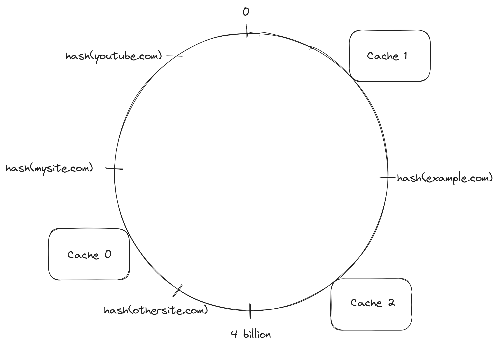
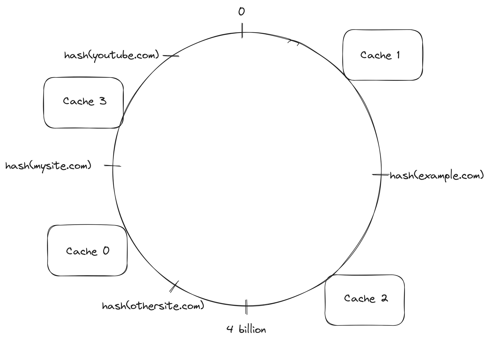
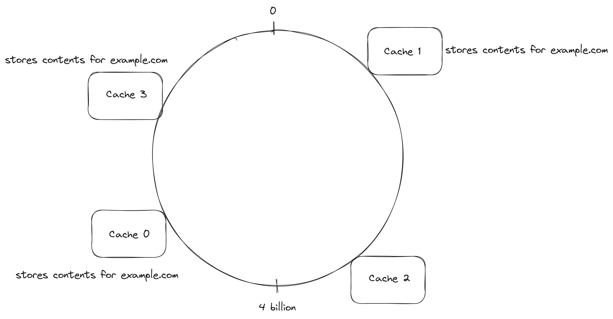
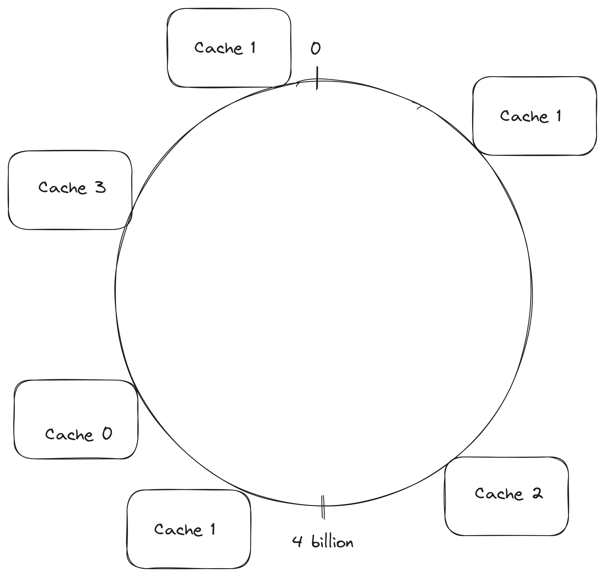

As the [World Wide Web](https://en.wikipedia.org/wiki/World_Wide_Web) became more popular all of sudden a server could receive way more traffic than it could handle causing the server to service requests slowly or to not be able to serve them at all[^web_caching_with_consistent_hashing]. An intuitive solution to this problem is to cache[^cache] the content served by the servers and allow the clients to fetch content from the caches instead of going through the original server. Several clients communicate with the same cache servers which means that if client `1` fetches the contents for the page `example.com`, client `2` can fetch the same contents from the cache instead of going to the oirignal server if it decides to visit `example.com` as well.  

<i>When the first client fetches the contents for example.com a request is sent to the original server but when the second client tries to fetch the content for example.com the contents are cached in the cache server</i>

Running a single cache server is not feasible given the amount of data it would need to store could be huge and if the cache stopped for working for any reason, the clients would go directly to the original servers that have content the clients wish to download and the servers could get overloaded.

<i>Client can't connect to the cache so it goes directly to the server</i>

The single point of failure can be removed by running many cache serves instead of just one but that creates another problems with one them being: **how does the client know which cache should have the contents for the website it wants to fetch the contents**?  

Given a fixed number `n` of cache servers, identified by a number from `0` to `n - 1`, the client can [mod](https://en.wikipedia.org/wiki/Modulo) the [hash](hash_function) of the [url](https://en.wikipedia.org/wiki/URL) by `n` to find out which cache server a request should be sent to. Since the same input will always hash to the same value, different clients trying to fetch the contents for the same url would always go for the same cache.

<i>Clients hash the url to find out which cache server to contact</i>

In reality there would be a large number of cache servers instead of just a few which means some cache servers would stop working and that new cache servers would be added all the time. Using the hash of the url mod the number of cache servers invalidates the cached data as soon as the number of cache servers changes even if most of the data is still valid. It would be nice to be able to change the number of cache serves while keeping the as much as possible of the cached contents.

<i>Since a new server was added, the result of mod operation changes which causes clients to contact a cache server that does not have the contents they are looking for. The contents are in cache 1.</i>

Consistent hashing allows the number of cache servers to be changed while invalidating only a small part of the cached data. The clients are still going the hash the url to find out which server a request should be sent to but instead of using the mod of the hash to find the server, servers are going to be in a ring.  

<i>A ring containing 3 cache servers. The position of each cache server in the ring is found by hashing something that identifies each server</i>

Given a ring, the server identifiers are hashed and the hash value is used to decide where each server is located in the ring. A client that needs to decide which cache server should handle a request hashes the url and uses the value of the hash to determine where the url is located in the ring, after locating the url in the ring, the request is sent to the next server in the clockwise direction starting from the url location.

<i>The hash value of example.com is located after Cache 1 and before Cache 2 in the ring which means Cache 2 is the cache server responsible for handling the request because is it is the next server in the clockwise direction</i>

In constrat to the previous hash based solution, adding or removing a server invalidates only a small part of the cached data. Before adding the cache server `Cache 3`, a client looking for the contents of `mysite.com` would hash the url, the hash value would land after `Cache 0` and before `Cache 1` in the ring. The client would walk the ring in the clockwise direction, find `Cache 1` and sent the request to it. If a client wanted to fetch the contents for `example.com`, it would execute the same steps and sent the request to `Cache 2`.  

After adding the cache server `Cache 3`, a client looking for the contents of `mysite.com` would execute the same steps as before but this time while walking the ring in the clockwise direction, `Cache 3` would be the first server to be found which means the client would send the request to it. If a client wanted to fetch the contents for `example.com` again, the request would still go to `Cache 2`, same as before.

<i>Cache 3 was added and the only partition of the cached data that a client won't find in the next request before it is cached in another cache server is the cached contents for mysite.com</i>

At this time, the contents for each url are stored only in a single server, if higher durability is needed, the contents could be stored in more than one of the servers. The data could be replicated to the next `n` servers instead of the first server in the clockwise direction or more than one hash function could be used to find which servers should have the data.

<i>The contents of example.com are stored in Cache Cache 1, Cache 0 and Cache 3 at the same time</i>

Cache servers that have more resources should be able to store more data and handle more requests, at the moment the resources a cache server has are ignored.   

It is possible to use amount of resources a cache server has to decide how many times it appears in the ring, servers with more resources appear more times causing more requests to be sent to it because more hash values are going to be located near it.  

A way to decide where to place the same server is to use more than once hash function to find the server location in the ring. Servers that appear in the ring more than once are usually referred to as virtual servers.

<i>Cache 1 appears more than once in the ring because it has enough resources to handle 3 times more the number of requests other servers can handle</i>

Amazon Dynamo, Amazon's highly available key-value store used consistent hashing with virtual nodes to partition the load across storage servers[^dynamo_2007].  

ScyllaDB, a distributed NoSQL wide-column database uses consistent hashing to assign rows to partitions[^scylla_ring_architecture].  

Cassandra, a distributed NoSQL wide-column database uses consistent hashing to assign data to nodes[^cassandra_consistent_hashing].  

Chord, a distributed lookup protocol that maps keys onto nodes uses a variant of consistent hashing[^chord].  

Riak, a distributed NoSQL key-value database uses consistent hashing to decide which virtual node in the cluster stores each object[^riak_consistent_hashing].

[^cache]: https://en.wikipedia.org/wiki/Cache_(computing)  
[^hash_function]: https://en.wikipedia.org/wiki/Hash_function  
[^web_caching_with_consistent_hashing]: https://cs.brown.edu/courses/csci2950-u/f10/papers/chash99www.pdf  
[^dynamo_2007]: https://www.allthingsdistributed.com/files/amazon-dynamo-sosp2007.pdf  
[^scylla_ring_architecture]: https://opensource.docs.scylladb.com/stable/architecture/ringarchitecture/  
[^cassandra_consistent_hashing]: https://docs.datastax.com/en/cassandra-oss/3.0/cassandra/architecture/archDataDistributeHashing.html  
[^chord]: https://pdos.csail.mit.edu/papers/chord:sigcomm01/chord_sigcomm.pdf  
[^riak_consistent_hashing]: https://docs.riak.com/riak/kv/latest/learn/glossary/index.html#consistent-hashing  