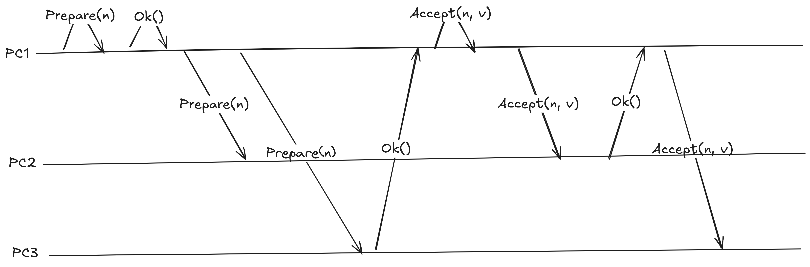

# <center>𝔇𝔢𝔱𝔢𝔯𝔪𝔦𝔫𝔦𝔰𝔱𝔦𝔠 𝔰𝔦𝔪𝔲𝔩𝔞𝔱𝔦𝔬𝔫 𝔱𝔢𝔰𝔱𝔦𝔫𝔤</center>

### Example based testing

Example based testing works fine for simple cases where there's only a small number of actions that matter.

```ocaml
let%test_unit "append entries: truncates the log on entry conflict" =
  let storage = make { dir = Test_util.temp_dir () } in

  (* Leader adds some entries to the replica's log. *)
  append_entries storage (last_log_index storage)
    [
      { term = 1L; data = "1" };
      { term = 2L; data = "2" };
      { term = 3L; data = "3" };
    ];

  (* Another leader overrides the replica's log. *)
  append_entries storage 2L
    [ { term = 4L; data = "3" }; { term = 4L; data = "4" } ];

  assert (entry_at_index storage 1L = Some { term = 1L; data = "1" });
  assert (entry_at_index storage 2L = Some { term = 2L; data = "2" });
  (* Entry at index 3 has been overwritten. *)
  assert (entry_at_index storage 3L = Some { term = 4L; data = "3" });
  (* Entry at index 4 is new. *)
  assert (entry_at_index storage 4L = Some { term = 4L; data = "4" })
```

It becomes way harder to think of and write the examples when the bugs you're looking for only happen after several events that need to happen in a specific order.


<center>A bug found deep in the input tree.</center>

### Property based testing

Property based testing is a testing technique where a wide range of inputs are generated automatically unlike traditional example based testing where the inputs have to be manually thought of and written. The idea is that by auto generating inputs, the system will end up being tested with inputs that the programmer wouldn't think of otherwise.

**Basic input**  
Given a vec of integers `nums` and an integer `k`, returns the the kth largest element in the array.  

In this case, the implementation uses a max heap instead of sorting the input to find the kth largest element in the array.  

```rust
fn find_kth_largest(nums: Vec<i32>, k: i32) -> i32 {
    let mut heap: BinaryHeap<_> = nums.into_iter().collect();
    for _ in 0..k as usize - 1 {
        let _ = heap.pop();
    }
    heap.pop().unwrap()
}
```

The test generates a random `Vec<i32>`, finds the kth largest element by sorting the vec -- *using a different and probably easier to understand implementation than the function being tested* -- and asserts that the function returns the same value.

```rust
#[cfg(test)]
mod tests {
    use quickcheck::quickcheck;
    use super::*;
    fn check(nums: Vec<i32>, k: usize, f: fn(Vec<i32>, i32) -> i32) -> bool {
        if nums.is_empty() {
            return true;
        }
        let k = 1 + k % nums.len();
        let mut nums = nums;
        nums.sort_unstable();
        nums.reverse();
        let expected = nums[k - 1];
        expected == f(nums, k as i32)
    }
    quickcheck! {
      #[test]
      fn test_find_kth_largest(nums: Vec<i32>, k: usize) -> bool {
        check(nums, k, find_kth_largest)
      }
    }
}
```

Ideally, one or more properties would be defined and checked against the output but starting simple like this works well in a lot of cases.

```rust
fn sort(nums: &mut Vec<i32>) {
    ...
}

#[cfg(test)]
mod tests {
    use quickcheck::quickcheck;
    use super::*;
    quickcheck! {
      #[test]
      fn test_sort(nums: Vec<i32>) -> bool {
        let mut nums = nums;
        sort(&mut nums);
        if !nums.is_empty() {
          for i in 0..nums.len()-1 {
            assert!(nums[i] <= nums[i+1]);
          }
        }
        true
      }
    }
}
```

*Property*: After sorting, every `nums[i]` is less than or equal to `nums[i + 1]`.

- Generate a large number of inputs randomly instead of writing just a few of them manually.

**More sophisticated inputs**  
Imagine that a max heap with a different implementation from the std library was being written. The std heap could be used as a model to check that our heap behaves correctly from the user's point of view.

```rust
#[cfg(test)]
mod tests {
    ...
    quickcheck! {
      #[test]
      fn test_heap(actions: Vec<Action>) -> bool {
        let mut heap = Heap::new();
        let mut model = BinaryHeap::new();
        for action in actions {
          match action {
            Action::Push(v) => {
              model.push(v);
              heap.push(v);
            },
            Action::Pop => {
              assert_eq!(model.pop(), heap.pop());
            }
          }
        }
        true
      }
    }
}
```

The same idea could be used to test other systems, the difference is that instead of using the std heap, a simplified model of the real thing would be used, for example, an in memory map that models a disk-based key-value store. Here's an example of a append-only log in Go.
```go
func TestFileStorage(t *testing.T) {
	t.Parallel()

	const (
		OpAppendEntries           = "AppendEntries"
		OpTruncateLogStartingFrom = "TruncateLogStartingFrom"
		OpGetEntryAtIndex         = "GetEntryAtIndex"
		OpGetBatch                = "GetBatch"
		OpLastLogIndex            = "LastLogIndex"
	)

	rapid.Check(t, func(t *rapid.T) {
		storage, err := NewFileStorage(fmt.Sprintf("%s/raft-go/%s", os.TempDir(), uuid.New().String()))
		assert.NoError(t, err)

		model := newModel()

		ops := rapid.SliceOf(rapid.SampledFrom([]string{
			OpAppendEntries,
			OpTruncateLogStartingFrom,
			OpGetEntryAtIndex,
			OpGetBatch,
			OpLastLogIndex,
		})).
			Draw(t, "ops")

		for _, op := range ops {
			switch op {
			case OpAppendEntries:
				entries := rapid.SliceOf(entryGenerator()).Draw(t, "append: entries")
				assert.NoError(t, storage.AppendEntries(entries))
				assert.NoError(t, model.AppendEntries(entries))

				t.Logf("appended %d entries\n", len(entries))

			case OpTruncateLogStartingFrom:
				maybeExistingIndex := rapid.Uint64Range(1, uint64(len(model.entries)*2)+1).Draw(t, "truncate: maybeExistingIndex")

				storageErr := storage.TruncateLogStartingFrom(maybeExistingIndex)
				modelErr := model.TruncateLogStartingFrom(maybeExistingIndex)

				t.Logf("truncated from index %d len(model.entries)=%+v storageErr=%+v modelErr=%+v\n", maybeExistingIndex, len(model.entries), storageErr, modelErr)

				assert.ErrorIs(t, storageErr, modelErr)

			case OpGetEntryAtIndex:
				maybeExistingIndex := rapid.Uint64Range(1, uint64(len(model.entries)*2)+1).Draw(t, "get entry: maybeExistingIndex")

				storageEntry, storageErr := storage.GetEntryAtIndex(maybeExistingIndex)
				modelEntry, modelErr := model.GetEntryAtIndex(maybeExistingIndex)

				t.Logf("getting entry at index %d storageErr=%+v modelErr=%+v\n", maybeExistingIndex, storageErr, modelErr)

				assert.Equal(t, modelEntry, storageEntry)
				assert.ErrorIs(t, storageErr, modelErr)

			case OpGetBatch:
				maybeExistingIndex := rapid.Uint64Range(1, uint64(len(model.entries)*2)+1).Draw(t, "get batch: maybe existing index")
				batchSize := rapid.Uint64Range(1, uint64(len(model.entries)*2)+1).Draw(t, "get batch: batch size")

				storageBatch, storageErr := storage.GetBatch(maybeExistingIndex, batchSize)
				modelBatch, modelErr := model.GetBatch(maybeExistingIndex, batchSize)

				t.Logf("get batch index=%d batchSize=%d len(storageBatch)=%+v storageErr=%+v len(modelBatch)=%+v modelErr=%+v\n",
					maybeExistingIndex,
					batchSize,
					len(storageBatch),
					storageErr,
					len(modelBatch),
					modelErr,
				)

				assert.ErrorIs(t, storageErr, modelErr)
				assert.Equal(t, modelBatch, storageBatch)

			case OpLastLogIndex:
				storageLastLogIndex := storage.LastLogIndex()
				modelLastLogIndex := model.LastLogIndex()

				assert.Equal(t, modelLastLogIndex, storageLastLogIndex)

			default:
				panic(fmt.Sprintf("unexpected op: %s", op))
			}
		}
	})
}
```

### Deterministic simulation testing

For more complicated systems, it can be hard to find edge cases using example based testing. What if the input space could be explored automatically by generating inputs in the same way inputs are generated for property based testing? After defining a model of how the system should work -- which actions and events the system should be able to handle -- component failures can be injected according to the failure model -- the failures the system should be able to handle --.

Start by removing non-determinism introduced by things such as threads or iterating over a data structure that yields a different order in each iteration. This means moving IO to the edges of the system and replacing the real implementation -- where it is not deterministic or fast enough -- with a fake version that behaves like the real thing.  

Next, generate actions using a seeded prng. When a bug is found, the simulation can be re-run with the same seed to hit the same bug over and over again.

- *Bugs are reproducible* by running the simulation with the seed that was used when the bug was found.

#### Example: The consensus problem

Applying deterministic simulation testing to single-decree Paxos.

Given a set of computers that can propose values, how to get the computers to decide on a value?  

- The chosen value must be proposed by one of the computers
- Only a single value can be chosen

#### The model

- Computers run at different speeds
- Computers may stop and restart at any time
- Messages sent from one computer to another can be lost, delayed or duplicated

#### Single-decree Paxos

[Paxos] is one of the algorithms that can be used to solve the consensus problem.  

The algorithm can be explained in two phases:

**Phase 1**  
- A computer that proposes values is called a `proposer`. A value is proposed by broadcasting a `Prepare(n)` message to the computers in the cluster where `n` is a unique monotonically increasing number.
- When a computer receives a `Prepare(n)` message, it responds with `Ok(accepted_proposal_number, accepted_value)` if `n` is the greatest proposal number it has seen so far where `accepted_proposal_number` and `accepted_value` are from latest proposal the computer has accepted, if any.

```rust
impl Replica {
    fn next_proposal_number(&mut self) -> Result<u64> {
        let state = contracts::DurableState {
            min_proposal_number: self.state.min_proposal_number + 1,
            ..self.state.clone()
        };
        self.storage.store(&state)?;
        self.state = state;
        Ok(self.state.min_proposal_number)
    }

    // Phase 1.
    fn on_start_proposal(&mut self, value: String) {
        let proposal_number = self.next_proposal_number().unwrap();
        self.broadcast_prepare(proposal_number, value);
    }

    // Phase 1.
    fn on_prepare(&mut self, input: PrepareInput) {
        if input.proposal_number > self.state.min_proposal_number {
            let mut state = self.state.clone();
            state.min_proposal_number = input.proposal_number;
            self.storage.store(&state).unwrap();
            self.state = state;

            self.bus.send_prepare_response(
                input.from_replica_id,
                PrepareOutput {
                    from_replica_id: self.config.id,
                    request_id: input.request_id,
                    accepted_proposal_number: self.state.accepted_proposal_number,
                    accepted_value: self.state.accepted_value.clone(),
                },
            );
        }
    }
...
```

**Phase 2**
- After broadcasting `Prepare(n)`, the proposer waits for responses from a majority of computers in the cluster
- After receiving responses from the majority, the proposer broadcasts a `Accept(n, v)` message to the computers in the cluster where `n` is the same proposal number sent in `Prepare(n)` message and `v` is the `accepted_value` from the message with the highest `accepted_proposal_number` received in response to the `Prepare(n)` messages or the value the proposer would like to choose if no proposals have been accepted yet.
- When a computer receives a `Accept(n, v)` message, it responds with `Ok()` if `n` is greater than or equal to the greatest proposal number it has seen in `Phase 1`.

>- The last used proposal number, the highest proposal number seen by a computer, the accepted proposal number and the accepted value are stored in durable storage.

```rust
...
    // Phase 2.
    fn on_prepare_response(&mut self, input: PrepareOutput) {
        let majority = self.majority();
        let request_id = input.request_id;

        if let Some(req) = self.inflight_requests.get_mut(&request_id) {
            req.responses.insert(input);

            if req.responses.len() < majority {
                return;
            }

            let value = req
                .responses
                .iter()
                .filter(|response| response.accepted_proposal_number.is_some())
                .max_by_key(|response| response.accepted_proposal_number)
                .map(|response| response.accepted_value.clone().unwrap())
                .unwrap_or_else(|| req.proposed_value.clone().unwrap());

            let proposal_number = req.proposal_number;
            self.broadcast_accept(proposal_number, value);
            self.inflight_requests.remove(&request_id);
        }
    }

    // Phase 2.
    fn on_accept(&mut self, input: AcceptInput) {
        if input.proposal_number >= self.state.min_proposal_number {
            let mut state = self.state.clone();
            state.accepted_proposal_number = Some(input.proposal_number);
            state.accepted_value = Some(input.value);
            self.storage.store(&state).unwrap();
            self.state = state;

            self.bus.send_accept_response(
                input.from_replica_id,
                AcceptOutput {
                    from_replica_id: self.config.id,
                    request_id: input.request_id,
                    min_proposal_number: self.state.min_proposal_number,
                },
            );
        }
    }
}
```


<center>An example of a Paxos round.</center>

**The simulation**  

Let's start by replacing the message bus with a fake one. The fake bus holds messages in an in-memory queue instead of sending them through the network.
```rust
struct SimMessageBus {
    queue: RefCell<MessageQueue>,
}
```

Then generate a seed that will be used by the prng to generate inputs to the system. The seed can be passed as input to generate the same sequence of inputs after a test failure happens.

```rust
#[cfg(test)]
mod tests {
    ...
    #[test]
    fn action_simulation() -> Result<()> {
        let seed: u64 = std::env::var("SEED")
            .map(|v| v.parse::<u64>().unwrap())
            .unwrap_or_else(|_| rand::thread_rng().gen());

        eprintln!("SEED={seed}");

        let rng = Rc::new(RefCell::new(rand::rngs::StdRng::seed_from_u64(seed)));
        ...
    }
}
```

The simulator uses the seeded prng to generate actions, which include actions such as delivering a message, crashing a replica, generating a user request and more. The simulator generates `max_actions` actions where each action is generated based on the current state of the system, this is done to improve the number of interesting input sequences. It is not that useful to crash a replica that's already in the crashed state.

```rust
struct ActionSimulator {
    config: ActionSimulatorConfig,
    rng: Rc<RefCell<StdRng>>,
    bus: Rc<SimMessageBus>,
    replicas: Vec<Replica>,
}

enum Action {
    SendUserRequest,
    CrashReplica,
    RestartReplica,
    DeliverMessage,
    DropMessage,
    DuplicateMessage,
}

impl ActionSimulator {
    fn next_action(&mut self) -> Action {
      // Use the prng + knowledge about the current system state to generate the next action.
      // It's not that useful to crash a replica that's already in the crashed state.
    }
    fn run(&mut self) {
        for i in 0..self.config.max_actions {
            let action = self.next_action();
            match action {
              Action::SendUserRequest => {
                // Trigger a proposal from a replica.
              }
              Action::CrashReplica => {
                // Crash a random replica.
              }
              Action::RestartReplica => {
                // Restart a random replica.
              }
              Action::Delivermessage => {
                // Deliver a random message from the messages in flight.
              }
              Action::DropMessage => {
                // Drop a random message from the messages in flight.
              }
              Action::DuplicateMessage => {
                // Duplicate a random message from the messages in flight.
              }
            }
        ...
        }
    }
}
```

When a `Action::DeliverMessage` is executed, a random message is removed from the queue and delivered to the target replica:
```rust
fn pop(&mut self) -> Option<PendingMessage> {
        if self.items.is_empty() {
            return None;
        }

        let i = self
            .rng
            .as_ref()
            .borrow_mut()
            .gen_range(0..self.items.len());
        let item = self.items.swap_remove(i);
        Some(item)
}
```

Then instantiate the replicas and start the simulator. The simulation will run `10000` times where each run will generate `1000` actions (e.g. `CrashReplica`, `DeliverMessage`). This simulator is actually running several threads with one simulation each to find bugs faster. The simulation is in each thread is deterministic.

```rust
#[cfg(test)]
mod tests {
    ...
    #[test]
    fn action_simulation() -> Result<()> {
        let count = if std::env::var("SEED").is_ok() {
            1
        } else {
            std::env::var("MAX_THREADS")
                .map(|v| v.parse::<usize>().unwrap())
                .unwrap_or_else(|_| std::thread::available_parallelism().unwrap().get())
        };

        let max_iters = std::env::var("MAX_ITERS")
            .map(|v| v.parse::<u64>().unwrap())
            .unwrap_or_else(|_| 10_000);

        let max_actions = std::env::var("MAX_ACTIONS")
            .map(|v| v.parse::<u32>().unwrap())
            .unwrap_or_else(|_| 100);

        eprintln!("Spawning {count} threads");

        let handles = (0..count)
            .map(|thread_id| {
                std::thread::Builder::new()
                    .name(format!("Thread({thread_id})"))
                    .spawn(move || {
                        let seed: u64 = std::env::var("SEED")
                            .map(|v| v.parse::<u64>().unwrap())
                            .unwrap_or_else(|_| rand::thread_rng().gen());

                        eprintln!("SEED={seed}");

                        let rng = Rc::new(RefCell::new(rand::rngs::StdRng::seed_from_u64(seed)));

                        for i in 0..max_iters {
                            if i % 1_000 == 0 {
                                eprintln!("Thread({thread_id}) Running simulation {i}");
                            }

                            let simulator_config = {
                                let mut rng = rng.borrow_mut();
                                ActionSimulatorConfig {
                                    max_actions,
                                    max_user_requests: rng.gen::<u32>() % 100 + 1,
                                }
                            };

                            let activity_log = Rc::new(RefCell::new(ActivityLog::new()));

                            let servers = vec![1, 2, 3];

                            let majority = servers.len() / 2 + 1;

                            let bus: Rc<SimMessageBus> = Rc::new(SimMessageBus::new(
                                Rc::clone(&rng),
                                Oracle::new(majority, Rc::clone(&activity_log)),
                                Rc::clone(&activity_log),
                            ));

                            let nodes: Vec<_> = servers
                                .iter()
                                .map(|id| {
                                    let fs = Rc::new(SimFileSystem::new());
                                    Node {
                                        replica: Replica::new(
                                            Config {
                                                id: *id,
                                                replicas: servers.clone(),
                                            },
                                            Rc::clone(&bus) as Rc<dyn contracts::MessageBus>,
                                            Rc::new(
                                                FileStorage::new(
                                                    Rc::clone(&fs) as Rc<dyn contracts::FileSystem>,
                                                    PathBuf::from("dir"),
                                                )
                                                .unwrap(),
                                            ),
                                        ),
                                        fs,
                                    }
                                })
                                .collect();

                            let mut sim = ActionSimulator::new(
                                simulator_config,
                                Rc::clone(&rng),
                                nodes,
                                Rc::clone(&bus),
                                Rc::clone(&activity_log),
                            );

                            let result = std::panic::catch_unwind(move || {
                                sim.run();
                                assert!(sim.bus.is_empty());
                            });
                            if result.is_err() {
                                activity_log.borrow_mut().print_events();
                                eprintln!("SEED={seed}");
                                std::process::exit(1);
                            }
                        }
                    })
            })
            .collect::<Result<Vec<_>, _>>()?;

        for handle in handles {
            handle.join().unwrap();
        }

        Ok(())
    }
}
```

In a sense, the number of times the simulation runs can be understood as the max number of paths we would like to visit from a input tree  and `max_actions` can be thought of as the depth of every path in the tree. The simulation may end up visiting the same path multiple times, solving that is an optimization for the future.


<center>An example of a path in the input tree where a message is delivered and then the replica crashes.</center>  

**Verifying the system state is valid**  

At the moment, the simulation doesn't do anything because there are no assertions. Let's add an oracle -- something that has a bird's eye view of the system -- that will receive a copy of the messages sent from replicas.

```rust
impl Oracle {
    pub fn on_accept_sent(&mut self, _to_replica_id: ReplicaId, input: &AcceptInput) {
        ...
    }

    pub fn on_proposal_accepted(&mut self, _to_replica_id: ReplicaId, output: &AcceptOutput) {
        ...
    }
}
```

The basic oracle keeps track of accepted proposals, after a proposal has been accepted by a majority of replicas, it asserts that no other value is even chosen.  

In this case, the system state is seen from the perspective of an outside observer that only has access to the messages sent from the replicas but there's nothing stopping assertions from being added to the internal modules or having the oracle inspect the internal state of the system under test.  

Even basic simulations can catch bugs. Let's ignore the requirement the proposal numbers must be unique by accepting proposal numbers that are the highest the replica has seen.

```rust
impl Replica {
    fn on_prepare(&mut self, input: PrepareInput) {
        --> Change from `>` to `>=`
        // if input.proposal_number > self.state.min_proposal_number {
        if input.proposal_number >= self.state.min_proposal_number {
            ...
        }
    }
  ...
}
```

Run the simulation:
```sh
cargo t action_simulation -- --nocapture

...
[BUS] Replica(1) -> Replica(1) RECEIVED Prepare(RID(R1, P12))
[BUS] Replica(1) -> Replica(1) QUEUED PrepareResponse(RID(R1, P12), Some(12), Some("V(3, 71)"))
[BUS] Replica(2) -> Replica(3) RECEIVED AcceptResponse(RID(R3, P12), 12)
[BUS] Replica(1) -> Replica(1) RECEIVED PrepareResponse(RID(R1, P12), Some(12), Some("V(3, 71)"))
[BUS] Replica(1) -> Replica(2) RECEIVED Prepare(RID(R1, P5))
[ORACLE] value accepted by majority of replicas: majority=2 RID(R3, P12) value=V(3, 71) replicas=[2, 1]
[BUS] Replica(1) -> Replica(3) RECEIVED AcceptResponse(RID(R3, P12), 12)
[ORACLE] value accepted by majority of replicas: majority=2 RID(R1, P12) value=V(1, 80) replicas=[2, 3]
SEED=13326481090957263017
```

Replay the bug by running the simulation with the seed to get the same sequence of inputs:
```sh
SEED=13326481090957263017 cargo t action_simulation -- --nocapture

...
[BUS] Replica(1) -> Replica(1) RECEIVED Prepare(RID(R1, P12))
[BUS] Replica(1) -> Replica(1) QUEUED PrepareResponse(RID(R1, P12), Some(12), Some("V(3, 71)"))
[BUS] Replica(2) -> Replica(3) RECEIVED AcceptResponse(RID(R3, P12), 12)
[BUS] Replica(1) -> Replica(1) RECEIVED PrepareResponse(RID(R1, P12), Some(12), Some("V(3, 71)"))
[BUS] Replica(1) -> Replica(2) RECEIVED Prepare(RID(R1, P5))
[ORACLE] value accepted by majority of replicas: majority=2 RID(R3, P12) value=V(3, 71) replicas=[2, 1]
[BUS] Replica(1) -> Replica(3) RECEIVED AcceptResponse(RID(R3, P12), 12)
[ORACLE] value accepted by majority of replicas: majority=2 RID(R1, P12) value=V(1, 80) replicas=[2, 3]
SEED=13326481090957263017
```

The simulator will generate `1000` actions by default but it only needs to generate `2` actions to find this bug. The advantage of generating less actions is that the error trace will contain less events:
```sh
MAX_ACTIONS=2 cargo t action_simulation -- --nocapture

...
[BUS] Replica(1) -> Replica(2) RECEIVED Prepare(RID(R1, P1))
[BUS] Replica(2) -> Replica(1) QUEUED PrepareResponse(RID(R1, P1), Some(1), Some("V(3, 1)"))
[BUS] Replica(1) -> Replica(3) RECEIVED PrepareResponse(RID(R3, P1), Some(1), Some("V(1, 0)"))
[BUS] Replica(2) -> Replica(1) RECEIVED PrepareResponse(RID(R1, P1), Some(1), Some("V(3, 1)"))
[BUS] Replica(3) -> Replica(3) RECEIVED AcceptResponse(RID(R3, P1), 1)
[ORACLE] value accepted by majority of replicas: majority=2 RID(R3, P1) value=V(3, 1) replicas=[1, 3]
[BUS] Replica(1) -> Replica(3) RECEIVED AcceptResponse(RID(R3, P1), 1)
[BUS] Replica(1) -> Replica(1) RECEIVED AcceptResponse(RID(R1, P1), 1)
[ORACLE] value accepted by majority of replicas: majority=2 RID(R1, P1) value=V(1, 0) replicas=[2, 1]
SEED=3996709105568464579
```

> Always remove the current bug before introducing a new one.

Let's have the replica reuse a proposal number:
```rust
impl Replica {
    fn next_proposal_number(&mut self) -> Result<u64> {
        ...
        // Comment this line
        // self.storage.store(&state)?;
        ...
        Ok(self.state.min_proposal_number)
    }
}
```

Run the simulation:
```sh
cargo t action_simulation -- --nocapture

...
assertion failed: `(left == right)`
  left: `Some("V(2, 14)")`,
 right: `Some("V(2, 98)")`: majority of replicas decided on a different value after a value was accepted
note: run with `RUST_BACKTRACE=1` environment variable to display a backtrace
SEED=6875993431596082141
```

The accepted proposal number and value must be persisted to durable storage. Let's forget to do that and see what happens.

```rust
impl Replica {
    fn on_accept(&mut self, input: AcceptInput) {
        if input.proposal_number >= self.state.min_proposal_number {
            let mut state = self.state.clone();
            state.accepted_proposal_number = Some(input.proposal_number);
            state.accepted_value = Some(input.value);
            // self.storage.store(&state).unwrap();
            self.state = state;

            self.bus.send_accept_response(
                input.from_replica_id,
                AcceptOutput {
                    from_replica_id: self.config.id,
                    request_id: input.request_id,
                    min_proposal_number: self.state.min_proposal_number,
                },
            );
        }
    }
}
```

Run the simulation:
```sh
cargo t action_simulation -- --nocapture

...
assertion `left == right` failed: majority of replicas decided on a different value after a value was accepted
  left: Some("V(1, 17)")
 right: Some("V(2, 38)")
SEED=6875993431596082141
```

After sending a `Prepare(n)` message and receiving responses from a quorum, the value sent in `Accept(n, v)` messages must be the value accepted in the proposal with the highest proposal number. Let's forget to look for the accepted value and always send the value the proposer wants to.

```rust
impl Replica {
    fn on_prepare_response(&mut self, input: PrepareOutput) {
        let majority = self.majority();
        let request_id = input.request_id;

        if let Some(req) = self.inflight_requests.get_mut(&request_id) {
            req.responses.insert(input);

            if req.responses.len() < majority {
                return;
            }

            let value = req.proposed_value.clone().unwrap();

            let proposal_number = req.proposal_number;
            self.broadcast_accept(proposal_number, value);
            self.inflight_requests.remove(&request_id);
        }
    }
}
```

Run the simulation:
```sh
cargo t action_simulation -- --nocapture

...
assertion `left == right` failed: majority of replicas decided on a different value after a value was accepted
  left: Some("V(1, 99)")
 right: Some("V(1, 40)")
...
[BUS] Replica(1) -> Replica(1) RECEIVED AcceptResponse(RID(R1, P10), 10)
[ORACLE] value accepted by majority of replicas: majority=2 RID(R1, P10) value=V(1, 40) replicas=[1, 2]
SEED=6369495520157998847
```

Even better, let's forget to fsync the file that contains the replica state:
```rust
impl FileStorage {
    fn store(&self, state: &contracts::DurableState) -> std::io::Result<()> {
        ...
        // Comment this line.
        // file.sync_all()?;
        ...
        Ok(())
    }
}
```

Run the simulation:
```sh
cargo t action_simulation -- --nocapture

...
assertion failed: `(left == right)`
  left: `Some("V(1, 0)")`,
 right: `Some("V(1, 58)")`: majority of replicas decided on a different value after a value was accepted
...
[BUS] Replica(3) -> Replica(1) QUEUED AcceptResponse(RID(R1, P5), 5)
[BUS] Replica(1) -> Replica(1) RECEIVED AcceptResponse(RID(R1, P5), 5)
[ORACLE] value accepted by majority of replicas: majority=2 RID(R1, P5) value=V(3, 59) replicas=[1, 2]
SEED=7923659261799353388
```

Atomically writing to a file is complicated, let's forget to fsync the directory since the atomic rename trick is being used:
```rust
impl FileStorage {
    fn store(&self, state: &contracts::DurableState) -> std::io::Result<()> {
        ...
        // Comment this line.
        // self.dir_file.sync_all()?;
        ...
        Ok(())
    }
}
```

Run the simulation:
```sh
cargo t action_simulation -- --nocapture

...
assertion failed: `(left == right)`
  left: `Some("V(1, 2)")`,
 right: `Some("V(3, 27)")`: majority of replicas decided on a different value after a value was accepted
note: run with `RUST_BACKTRACE=1` environment variable to display a backtrace
SEED=11856967350924232882
```

### Note on P

[P] is a state machine programming language for modeling and specifying distributed systems. P is used for modeling while the simulator is used to test the real system, using the real components whenever possible. The overall structure of the system is pretty similar to the structure of a P program.

The implementation:
```js
type request_id = (node_id: int, request_number: int);

type prepareReq = (node: Node, request_id: request_id, proposal_number: int);
type prepareResp = (node: Node, request_id: request_id, node_id: int, proposal_number: int, accepted_proposal_number: int, accepted_value: int);

type acceptReq = (node: Node, request_id: request_id, node_id: int, proposal_number: int, value: int);
type acceptResp = (request_id: request_id, node_id: int, min_proposal_number: int);

type valueAcceptedReq = (node_id: int, value: int);

type setNodesReq = (m: machine, nodes: seq[Node]);
event eSetNodes: setNodesReq;
event eSetNodesResponse;

event eTriggerPrepare;

event ePrepare: prepareReq;
event ePrepareResp: prepareResp;

event eAccept: acceptReq;
event eAcceptResp: acceptResp;

event eValueAccepted: valueAcceptedReq;
event eRestart;
event eCrash;

enum MessageType {
  PREPARE,
  ACCEPT
}

machine Node {
  start state Init {
    entry (node_id: int) {
      ...
    }
  }

  state Crashed {
    on eRestart goto Restarting;
    ignore eCrash, eTriggerPrepare, ePrepare, ePrepareResp, eAccept, eAcceptResp;
  }

  state Restarting {
    entry {
      requests = default(map[(MessageType, int), (value: int, responses: set[(node_id: int, accepted_proposal_number: int, accepted_value: int)])]);
      goto HandleRequests;
    }
  }

  state HandleRequests {
    ignore eRestart;

    on eCrash goto Crashed;
    
    on eTriggerPrepare do {
      ...
    }

    on ePrepare do (req: prepareReq) {
      ...
    }

    on ePrepareResp do (req: prepareResp) {
      ...
    }

    on eAccept do (req: acceptReq) {
      ...
    }

    on eAcceptResp do (req: acceptResp) {
      ...
    }
  }
}

fun quorum(num_nodes: int): int {
  return num_nodes / 2 + 1;
}
```

The spec:
```js
event spec_EventuallyDecideOnSameValue_num_nodes: int;

spec EventuallyDecideOnSameValue observes spec_EventuallyDecideOnSameValue_num_nodes, eValueAccepted {
  // Node id -> value the node accepted. Node ids for nodes that haven't accepted a value aren't in the map.
  var accepted_values: map[int, int];
  // The value accepted by a majority of nodes. 0 means unset.
  var accepted_value: int;
  // The minimum number of nodes that form a majority in the cluster.
  var majority: int;

  start state Init {
    on spec_EventuallyDecideOnSameValue_num_nodes do (num_nodes: int) {
      majority = num_nodes / 2 + 1;
      goto WaitingForDecision;
    }
  }

  // Nodes must eventually decide.
  hot state WaitingForDecision {
    on eValueAccepted do (req: valueAcceptedReq) {
      accepted_values[req.node_id] = req.value;

      accepted_value = getValueAcceptedByMajority();
      print format("debug: WaitingForDecision accepted_values={0}", accepted_values);
      // No value accepted yet.
      if(accepted_value == 0) {
        return;
      }

      goto EnsuringDecisionDoesntChange;
    }    
  }


  // After a majority of the nodes decide on a value, the value cannot change.
  state EnsuringDecisionDoesntChange {
    on eValueAccepted do (req: valueAcceptedReq) {
      var value: int;

      accepted_values[req.node_id] = req.value;

      value = getValueAcceptedByMajority();

      assert accepted_value == value, format("nodes decided on a new value after a value has already been decided. old={0} new={1}", accepted_value, value);
    }    
  }
}
```

[P]: https://p-org.github.io/P/
[Paxos]: https://lamport.azurewebsites.net/pubs/paxos-simple.pdf  