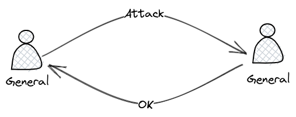

It feels like most people are not used to thinking about how things can fail, programming as if things always work as expected is the default modus operandi of most engineers i have talked to. Some examples that come to mind: http requests without handling responses that don't have status 200, no timeouts, no retries, publishing a message to kafka and them updating a database, having a web client orchestrate a transaction across several systems without thinking: what if the user closes the browser tab?

Since many things actually work as expected most of the time, it is easy to forget that something like the network is an `un`[reliable](https://aphyr.com/posts/288-the-network-is-reliable) system where messages can be delayed, lost[^wikipedia_packet_loss] and reordered[^wikipedia_out_of_order_delivery] and that most of the time it is the systems and protocols that run on top of the network that need to handle the work necessary to make the network `seem` reliable.

Distributed systems literature usually refers to the network connecting two processes as a `link`. The simplest type of link is called a `fair-loss` link, when a process `P1` send a message `M` to a process `P2`, the message is in one of three states: `will be delivered in the future`, `delivered` or `lost`.  

A `fair-loss` link does not offer any type of delivery guarantee or delivery confirmation because it is an *unreliable* `link`. The only thing the sender can do it to send a message and hope it is delivered, the receiver could send another message informing the sender that the message has been delivered but there's no guarantee that the message will be delivered.

The two generals problem[^wikipedia_two_generals_problem] states that there are two friendly generals separated in different camps and they need to coordinate the time to attack because the only way to defeat the enemy is to combine their armies strength, attacking alone means losing the battle.  

A general that wants to attack at a specific time sends a message to the general in the other camp to let them know the time of the attack. The problem is that the message is being carried by a soldier that may be captured, get lost or die. The message is being sent over an *unreliable* `link`.

A general that receives a message specifying the time of the attack needs to let the other general know that the message has been received. Acknowledgement happens by sending a message to the general that sent the first message but again there's no guarantee that the message will ever be delivered because the link is unreliable.

Turns out that there's no way to guarantee that the generals will reach consensus about when to attack if messages can be completely lost because both generals are always one message away from knowing what the other general wants to do.

[^wikipedia_packet_loss]: https://en.wikipedia.org/wiki/Packet_loss
[^wikipedia_out_of_order_delivery]: https://en.wikipedia.org/wiki/Out-of-order_delivery
[^wikipedia_two_generals_problem]: https://en.wikipedia.org/wiki/Two_Generals%27_Problem