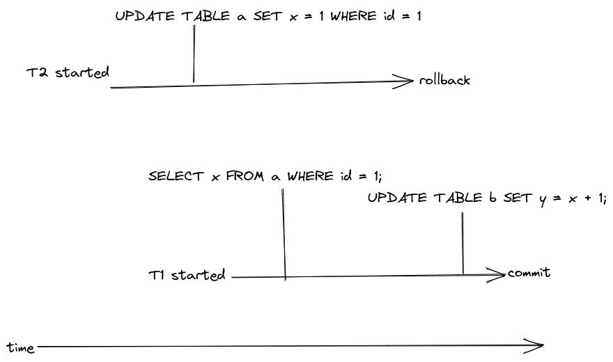
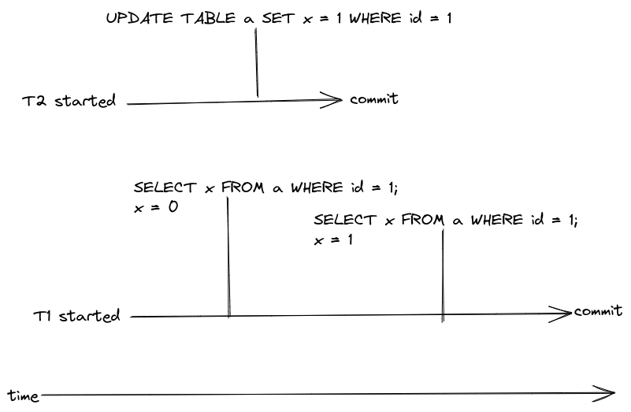
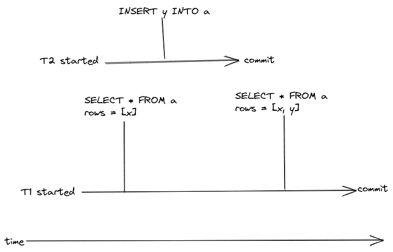
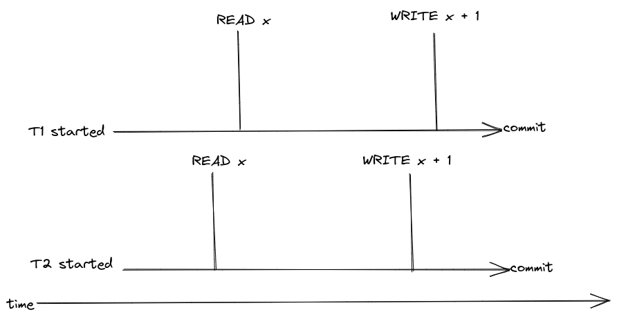
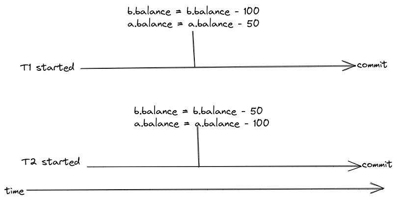

## Anomalies

An anomaly or read phenomena can happen when a transaction reads data that may have been modified by another concurrent transaction. 

### Dirty read

A `dirty read` happens when a transaction `T1` reads data that has been modified by a concurrent transaction `T2` that has not has been committed or rolled back yet. `T1` ends up working with stale data if `T2` does not commit.

`T2` starts executing and sets `x` to a new value, `T1` starts executing and reads `x`, the value of `x` is the value just set by `T2`, `T2` rolls back, the value of `x` is not persisted to the database but `T1` will move forward with the stale value of `x` that was written before `T2` rolled back.

### Non-repeatable read

A `non-repeatable read` happens when a transaction `T1` reads a value `x` before and after it is modified by a transaction `T2` and `T2` has committed. If `x` has been assigned a new value by `T2`, `T1` will have seen two different values for the same variable in a transaction.

`T1` reads `x` with value `0`, `T2` updates `x` to `1` and commits and then `T1` reads `x` again but the value is now `1`.

### Phantom reads

A `phantom read` is almost like a non-repeatable read but it is said to happen when more than one row is being selected.   

A transaction `T1` executes a statement to select a set of rows, a concurrent transaction `T2` executes a statement that modifies, inserts or deletes a row and commits. `T1` executes the first statement again hoping to select the same set of rows but a different set is returned.

`T1` starts executing and selects a set of rows from `a`, while `T1` executing, `T2` inserts a new row into `a` and commits, when `T1` tries to read the same set of rows from `a` it gets a different set because a new element was added by `T2`.

### Lost updates

A `lost update` may happen when transactions `T1` and `T2` both read and try to update  `x` using the just read value. Similarly to what happens when two threads try to update a variable without synchronization, one of the transactions may read `x` just a little bit before the other one updates it and end up working with a stale value.

In this example, there are two transactions `T1`and `T2`. Both are executing concurrently and both read `x` and increment its value by `1`, if `x` had the value 0 the expectation would be that the new value of `x` would be `2` after both transactions commit but the reality is that the new value of `x` will be `1` because both transactions read `0` before incrementing it by `1`.

### Write skew

A `write skew` happens when concurrent transactions respect database invariants(e.g `table.x > 0`) but when committed break one or more invariants.

Assuming that `a.balance + b.balance > 0` is an invariant, both transactions `T1` and `T2` respect the invariant on their own and are allowed to commit, but after both transactions are committed the invariant is broken.

## Isolation levels

Read and write anomalies can be avoided by choosing the right isolation level.

### Read uncomitted

`Dirty reads` are allowed, transactions can read data that has been modified by other transactions even if they have not been committed yet.

### Read committed

Allows transaction `T1` to read data that has been committed by other transactions while `T1` is still executing, `repeatable-reads` are not guaranteed.

### Repeteable reads

Same as read committed but reading `x` will always result in the same value.

### Serializable

Each transaction behaves like they are executed to completion before another transactions starts executing.

## References

[Database internals](https://www.databass.dev/)