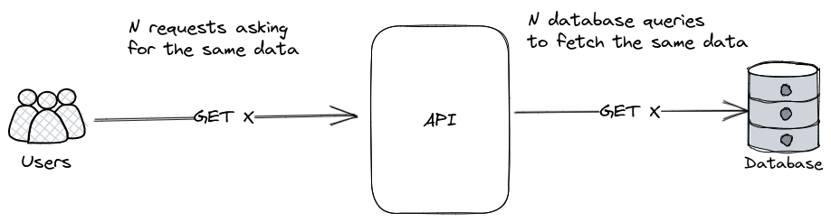
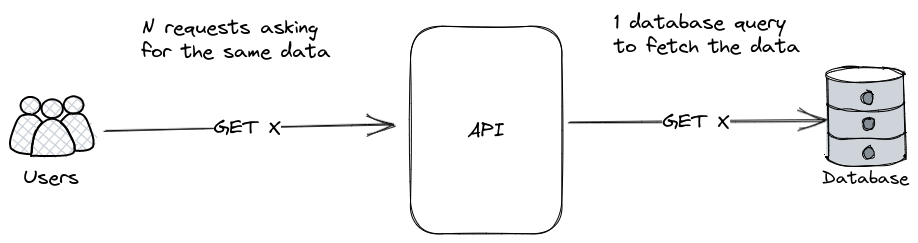
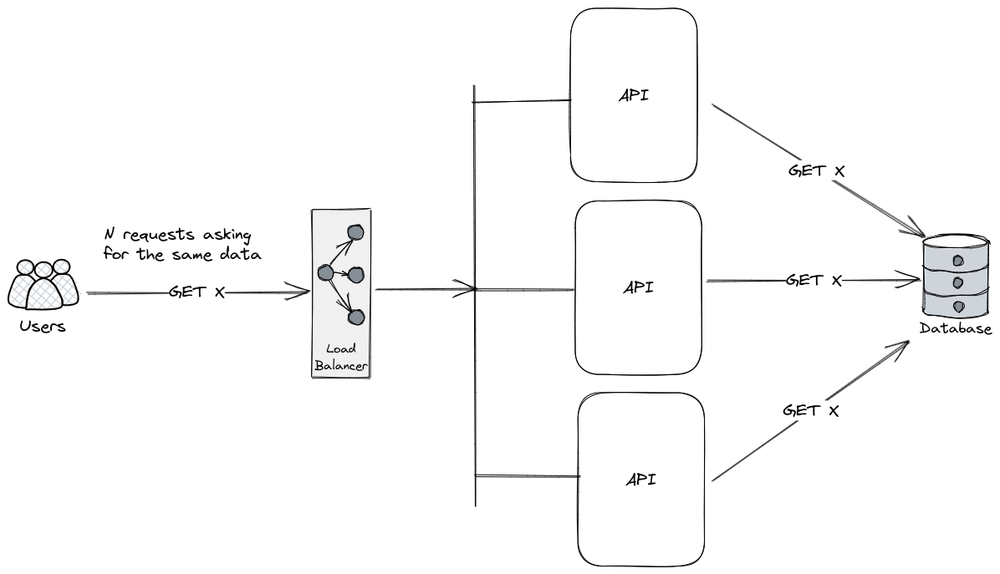
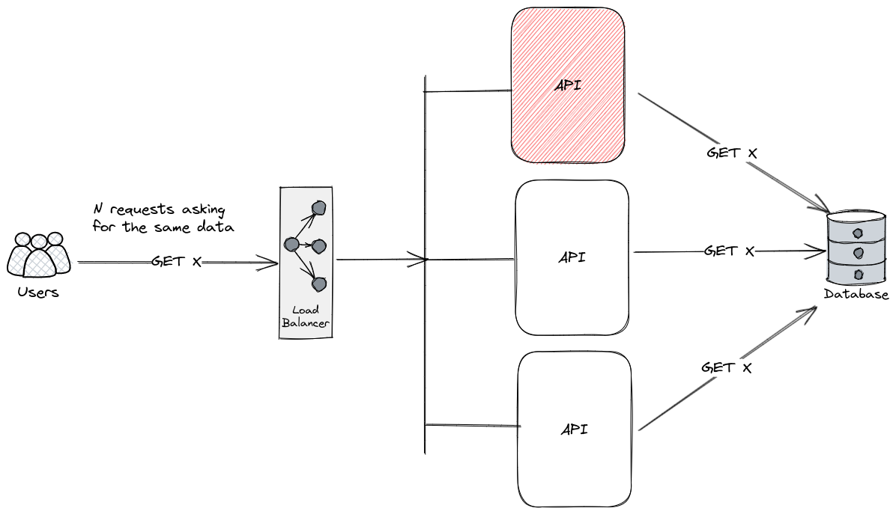

## The problem

You are developing an application backed by a database, something happens and then several of your users try to access the same content.
Several requests are sent to your backend at almost the same time and your backend hits the database once for each request to fetch the same data.



## Fetching the data only once

If `N` requests asking for the same data arrive at the backend at around the same time, the backend could hit the database to fetch the data when the first request arrives and force the other requests to await until the data is fetched. When a response to the request sent to the database arrives at the backend with the data, the data can be shared with the requests that are waiting for it.



## Several servers

If there's more than one server it is possible that the number of requests sent to the database is equal to the number of servers because requests are load balanced between the servers available.



If there's a large number of servers, it may be desirable to route requests for the same data to the same server to decrease the number of requests sent to the database. In this case every request to `GET X` is routed to the first server.



## Doing it in Rust

Given a route to fetch some data by its id, the id can be used to decide when a request can be deduplicated.

```rust
route("fetch/{id}", handler)

async fn handler(id: u64) -> Response {
    let data = deduplicator.dedup(id, fetch(id)).await;
    Response::new(data)
}
```

## Notes

This post was inspired by Discord's [How Discord stores trillions of messages](https://discord.com/blog/how-discord-stores-trillions-of-messages)
