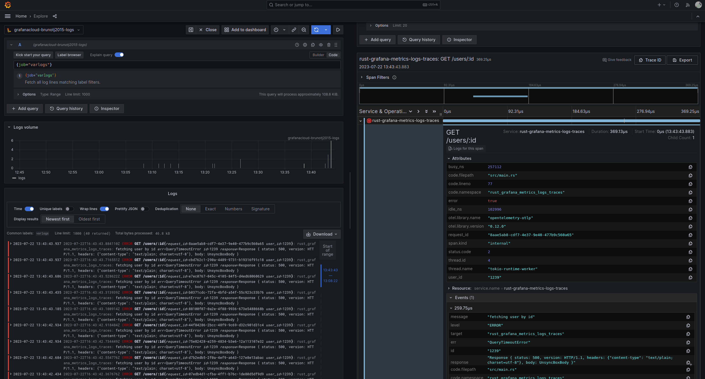

# Sending logs and traces from a Rust app to Grafana cloud



## Run the Grafana agent

- Put the Grafana agent config in `grafana-agent/agent/agent.yaml`.

```yaml
server:
  log_level: debug

logs:
  configs:
  - name: default
    positions:
      filename: /tmp/positions.yaml
    scrape_configs:
      - job_name: varlogs
        static_configs:
          - targets: [localhost]
            labels:
              job: varlogs
              app: rust-grafana-metrics-logs-traces
              __path__: /var/log/app/*log
    clients:
      - url: <grafana-cloud-loki-url>

traces:
  configs:
  - name: default
    receivers:
      otlp:
        protocols:
          grpc:

    remote_write:
      - endpoint: tempo-us-central1.grafana.net:443
        insecure: false  # only add this if TLS is not required
        basic_auth:
          username: <grafana-cloud-tempo-username>
          password: <grafana-cloud-tempo-password>
    batch:
      timeout: 5s
      send_batch_size: 100
```

- Run the Grafana agent

```sh
docker run \
  -v $PWD/grafana-agent/data:/etc/agent/data \
  -v $PWD/grafana-agent/agent.yaml:/etc/agent/agent.yaml \
  -v $PWD/log:/var/log/app \
  -p 4317:4317 \
  grafana/agent:v0.35.0
```

## Dependencies being used

Replace `axum` with whatever dependency you are using. The ones you'll use no matter the framework are:
- `opentelemetry`
- `opentelemetry-otlp`
- `opentelemetry_sdk`
- `tracing`
- `tracing-appender`
- `tracing-futures`
- `tracing-opentelemetry`
- `tracing-subscriber`

```toml
[dependencies]
axum = "0.6.19"
opentelemetry = { version = "0.19.0", features = ["rt-tokio"] }
opentelemetry-otlp = { version = "0.12.0", features = ["grpc-tonic", "reqwest-client", "tls-roots"] }
opentelemetry_sdk = "0.19.0"
serde = { version = "1.0.172", features = ["derive"] }
serde_json = "1.0.103"
tokio = { version = "1.29.1", features = ["macros", "rt-multi-thread"] }
tower-http = { version = "0.4.3", features = ["request-id"] }
tracing = "0.1.37"
tracing-appender = "0.2.2"
tracing-futures = "0.2.5"
tracing-opentelemetry = "0.19.0"
tracing-subscriber = { version = "0.3.17", features = ["env-filter"] }
uuid = "1.4.1"
```

Start by creating a `main` function and configuring `tracing_appender` to write log statements to a file called `app.log` asynchronously.

```rust
#[tokio::main]
async fn main() {
    let file_appender = tracing_appender::rolling::never("./log", "app.log");

    let (non_blocking, _guard) = tracing_appender::non_blocking(file_appender);

    let app = Router::new()
        .route("/users/:id", get(handler));

    let addr: SocketAddr = "0.0.0.0:3000".parse().unwrap();

    info!(?addr, "starting server");

    axum::Server::bind(&addr)
        .serve(app.into_make_service())
        .await
        .expect("running http server");
}
```

This is the request handler.

```rust
#[tracing::instrument(name="GET /users/:id", skip_all, fields(
  request_id = %ctx.request_id,
  user_id = %id
))]
async fn handler(ExtractContext(ctx): ExtractContext, Path(id): Path<u64>) -> Response {
    match get_user_by_id(id).await {
        Ok(user) => match user {
            None => (StatusCode::NOT_FOUND, StatusCode::NOT_FOUND.as_str()).into_response(),
            Some(user) => Json(user).into_response(),
        },
        Err(err) => {
            let response = (
                StatusCode::INTERNAL_SERVER_ERROR,
                StatusCode::INTERNAL_SERVER_ERROR.as_str(),
            )
                .into_response();

            error!(?err, ?id, ?response, "fetching user by id");

            response
        }
    }
}
```

Pretend there's some work being done.

```rust
#[derive(Debug, serde::Serialize)]
struct User {
    id: u64,
    name: String,
}

#[derive(Debug)]
struct QueryTimeoutError;

#[tracing::instrument(name="get_user_by_id", skip_all, fields(
  user_id = %id
))]
async fn get_user_by_id(id: u64) -> Result<Option<User>, QueryTimeoutError> {
    match id {
        1 => Ok(Some(User {
            id: 1,
            name: "bob".to_owned(),
        })),
        2 => Ok(Some(User {
            id: 1,
            name: "john".to_owned(),
        })),
        3 => Ok(None),
        _ => Err(QueryTimeoutError),
    }
}
```

Configure the open telemetry exporter.

```rust
#[tokio::main]
async fn main() {
    let file_appender = tracing_appender::rolling::never("./log", "app.log");

    let (non_blocking, _guard) = tracing_appender::non_blocking(file_appender);

    let tracer = opentelemetry_otlp::new_pipeline()
        .tracing()
        .with_exporter(
            opentelemetry_otlp::new_exporter()
                .tonic()
                .with_timeout(Duration::from_secs(5))
                .with_endpoint("http://localhost:4317"),
        )
        .with_trace_config(
            opentelemetry_sdk::trace::config()
                .with_max_events_per_span(64)
                .with_max_attributes_per_span(16)
                .with_max_events_per_span(16)
                .with_resource(Resource::new(vec![KeyValue::new(
                    "service.name",
                    env!("CARGO_PKG_NAME"),
                )])),
        )
        .install_batch(opentelemetry::runtime::Tokio)
        .expect("creating exporter");

    tracing_subscriber::registry()
        .with(tracing_subscriber::EnvFilter::new("INFO"))
        .with(tracing_opentelemetry::layer().with_tracer(tracer))
        .with(tracing_subscriber::fmt::layer().with_writer(non_blocking))
        .init();

    let app = Router::new()
        .route("/users/:id", get(handler));

    ...
}
```

Use the propagate request id middleware.

```rust
#[tokio::main]
async fn main() {
    ...
    let app = Router::new()
        .layer(SetRequestIdLayer::new(
            HeaderName::from_static(constants::REQUEST_ID),
            RequestUuid::default(),
        ))
        // propagate `x-request-id` headers from request to response
        .layer(PropagateRequestIdLayer::new(HeaderName::from_static(
            constants::REQUEST_ID,
        )))
        .route("/users/:id", get(handler));

    ...
}
```

Run the app.

```sh
cargo r

curl localhost:3000/users/1
curl localhost:3000/users/2
curl localhost:3000/users/3
curl localhost:3000/users/4
curl localhost:3000/users/5
```

See the logs and traces on your grafana instance.

