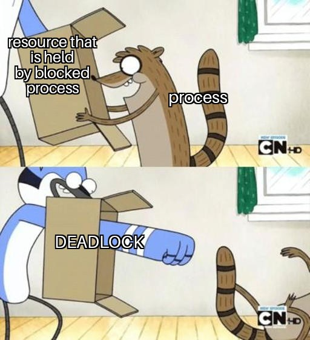
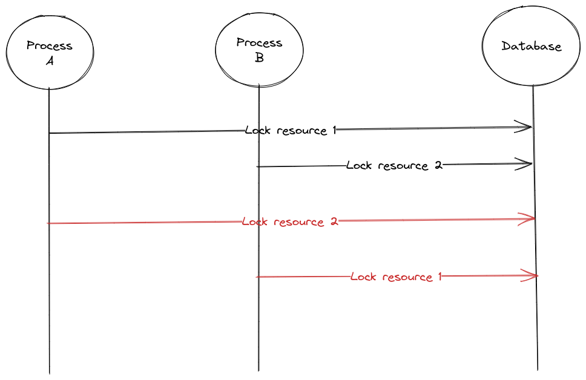
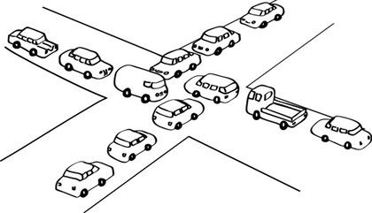
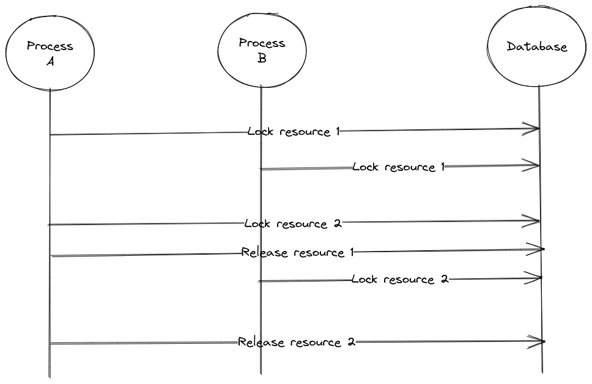

A deadlock happens when there's at least one resource that can be only acquired by one process at a time and there's a process `P1` that is waiting to acquire a resource currently held by a process `P2` and `P2` is waiting to acquire a resource currently held by `P1`.

> Process is not being used only to refer to an OS process.

There are two processes: Process `A` wants to acquire a lock on `resource 1` and then a lock on `resource 2`. Process `B` wants to acquire a lock on `resource 2` and then a lock on `resource 1`.  

In this specific execution process `A` acquires a lock on `resource 1` and process `B` acquires a lock on resource `2`, when process `A` tries to acquire a lock on `resource 2` it blocks waiting for process `B` to release the lock that it is holding on `resource 2`. The problem is that the lock on `resource 2` will never be released because process `B` is waiting for process `A` to release the lock on `resource 1`.

| Process A | Process B | 
| --------- | --------- |
| LOCK 1    | LOCK 2    |
| LOCK 2    | LOCK 1    |
| RELEASE 1 | RELEASE 2 |
| RELEASE 2 | RELEASE 1 |

A table showing the operations performed by each process concurrently. Dead lock occurs at the second set of operations when process `A` tries to lock `resource 2` and process `B` tries to lock `resource 1`.

Deadlocks can be easily avoided in this case by having both processes try to acquire locks on resources in the same order.

| Process A | Process B | 
| --------- | --------- |
| LOCK 1    | LOCK 1    |
| LOCK 2    | LOCK 2    |
| RELEASE 1 | RELEASE 1 |
| RELEASE 2 | RELEASE 2 |

By having both processes try to acquire the locks in the same order, the process that acquires the first lock will be able to proceed and acquire the other lock while the second process will block waiting for the first lock instead of acquiring another lock. When the first lock is released the process that is waiting will be able to proceed.

Process `A` acquires a lock on `resource 1`, process `B` tries to acquire the same lock but blocks because the resource is already locked, process `A` proceeds and acquires a lock on `resource 2` while process `B` is still blocked waiting for the lock on `resource 1`. Process `B` will be able to acquire locks on `resource 1` and `resource 2` only after process `A` releases them.